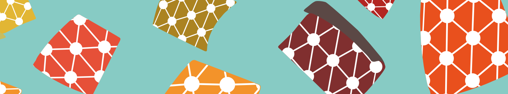

I am a Data Scientist with a background in Statistical Physics and Computational Neuroscience.  

I am currently working in the [Neuronal Networks for Memory Lab](https://www.ru.nl/donders/research/theme-3-plasticity-memory/research-groups-theme-3/neuronal-networks-memory/) at the [Donders Centre for Neuroscience](https://www.ru.nl/donders/) in Nijmegen (NL), where I develop data pipelines for the processing of brain imaging data (2-photon calcium inmaging and voltage-sensitive dye imaging), and statistical/ML models for predicting brain activity from behaiour.

As a fellow of the [Netherlands eScience center](https://www.esciencecenter.nl/), I developed an open source course on software developement and Machine Learning for neuroscientists. You can find it [here](https://neural-data-science-course.github.io/)

---

## Interests
- Predicitve models of neural activity
- Video segmentation and source extraction
- High-timensional multivariate time series analysis
- Optimal transport applications 
- Neural network theory

## Education
- PhD in Computational Neuroscience at  [SISSA](https://www.sissa.it/). (2020)
- M.Sc. in Physics of Complex Systems at [UniTo](https://www.unito.it/) (2016)
- B.Sc. in Physics at [UniTo](https://www.unito.it/) (2014)