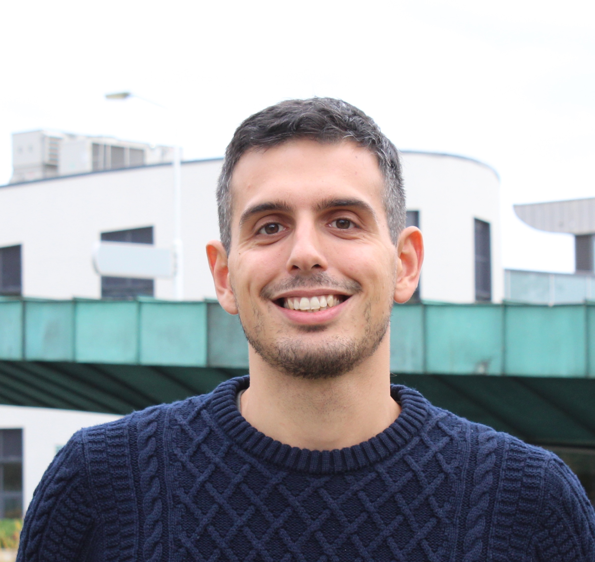
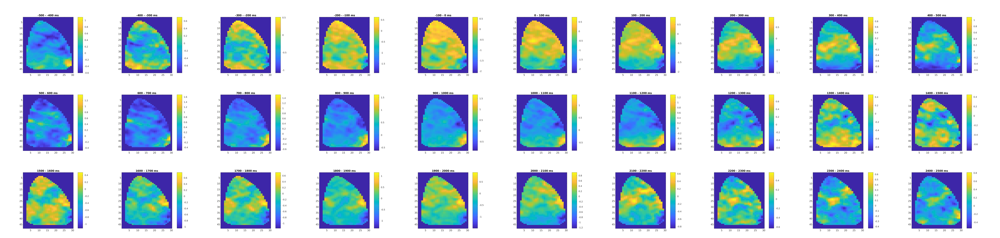

---
# Feel free to add content and custom Front Matter to this file.
# To modify the layout, see https://jekyllrb.com/docs/themes/#overriding-theme-defaults

layout: home
---

 

I am a posdoctoral researcher at the [Donders Institute](https://www.ru.nl/donders/) in Nijmegen (NL). 
I have a background in statistical physics and computational neuroscience, and I am working at the Neuronal Networks for Memory Lab, developing and applying machine learning tools for the analysis of neural data.
On this website you can find some information about me, my research interests and my current projects.

