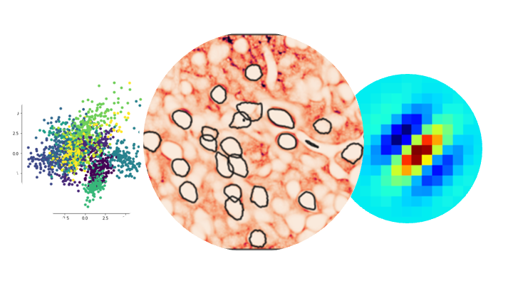

Open education for systems neuroscience
---

As a fellow of the [Netherlands eScience center](https://www.esciencecenter.nl/) I I developed a free and open source course on the foundamentals of software developement, data preprocessing and data analysis for researchers in systems neuroscience.

Check the course out at https://neural-data-science-course.github.io/