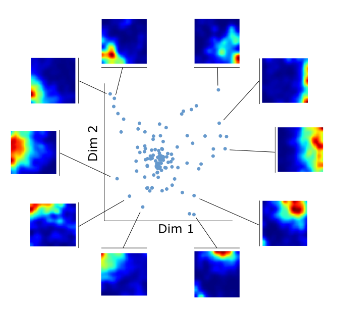

My research interests are mainly organized around three areas: 

- The study of memory and learning in  cortical and hippocampal neural popluations.
- The developement of data analysis and machine learning tools for systems neuroscience.
- The theory of neural networks in general, and of autoassociative memory models in particular.

---

## Current Projects
Here is an overview of the projects I am currently working on.

### Neural population coding of space and objects in the hippocampus

The hippocampus sits on top of the cortical hierarchy that, beginning from the primary responses to  sensory signals, builds the integrated representations that guide our behaviour and form our memories.
The hippocampal code is known for its complexity and its capacity to respond to a huge variety of stimuli, among which allocentric spatial location is one of the most well studied.

How does the code for space differ and interact with the representations of other salient features?

To tackle this question I am working with [Matteo Guardamagna](https://scholar.google.fi/citations?user=wGGPUeEAAAAJ&hl=pl) on elettrophysiological data he collected from the hippocampus of mice exploring arenas populated with different objects. 

The unconstrained behaviour of the animal spontaneously organizes itself in periods of *navigation* (with the animal running around or sitting still) and *object exploration* (with the animal interacting with the objects in the arena).

Our investigation shows that hippocampal responses have different statistical properites, in terms of dimensionality, stability and offline reactivation, between these two behavioural regimes.

---

### Compositional memory in dynamical continuous attractor networks

When we remember the past, or think about the future, our minds create rich scenes, comprising multiple elements and often the unfolding of a story over time.
Two elements, among others, are crucial for creating these mental images: *composition* of small items into larger scenes and a *dynamical* retrieval (or production) of the temporal structure.

In this project, in collaboration with [Alessandro Treves](https://people.sissa.it/~ale/), I am trying to understand how these elements can be combined in a mechanistic model of autoassociative memory.

In particular, we are investigatin the properties of a neural network endowed with [dynamical continuous attractors](https://elifesciences.org/articles/69499) and a compositional structure in its memorized patters.  
How does the compositional structure infulence the capacity of the network to retrieve memeories? How is does the memory dynamics change? These and other questions are the targets of our current investigation.

---

### Optimal transport measure of neural activity similarity

Measuring the similarity of neural activity is a problem with many applications in neuroscience, from the quantification of the variability of cell responses to reducing the dimensionality of large neural recordings.
Neural data often have a natural metric structure that can be used to quantify their similarity, for example the time difference between two spikes or the spatial distance at which they are emitted during the exploration of an environment.

When moving from the similarity between spikes to the similarity of overall cell responses, however, this metric structure is neglected by the most used information-theoretic measures, such as correlation, KL divergence or mutual information.

In this project, we aim to develop a framework to quantify the similarity between the activity of neural responses that takes into account the metric structure of the data space.

We apply this method to neural recordings in freely moving mice and show that it allows to cluster cells with similar activity in space, independently of their spatial information content. 
It yields distances that reflect distance relationships between place field peaks in the case of regular place fields and provide a more robust measure of similarity in the case of irregular or multimodal place fields.
This pairwise similarity structure can be used to investigate remapping at the population level, even between spaces with different geometries, as well as to quantify reactivation during sleep.

This framework provides a robust and versatile tool for the investigation of the similarity of neural responses and their changes across conditions.

---

## Publications

**Angular and linear speed cells in the parahippocampal circuits**  
**Spalla D.**, Treves A. & Boccara C. (2022).  
Nature Communications, [https://doi.org/10.1038/s41467-022-29583-z](https://doi.org/10.1038/s41467-022-29583-z)

**Continuous attractors for dynamic memories**    
**Spalla D.**, Cornacchia I.M. & Treves, A. (2021).  
eLife. [https://elifesciences.org/articles/69499](https://elifesciences.org/articles/69499)

**Space,time and memory in the Medial Temporal Lobe**  
**Spalla D.** (2020).  
SISSA Iris. [http://hdl.handle.net/20.500.11767/115780](http://hdl.handle.net/20.500.11767/115780)

**Can Grid Cell Ensembles Represent Multiple Spaces?**  
**Spalla D.**, Dubreuil A., Rosay S., Monasson, R. & Treves, A. (2019).  
*Neural computation*, *31*(12), 2324–2347. [https://doi.org/10.1162/neco_a_01237](https://doi.org/10.1162/neco_a_01237)  

